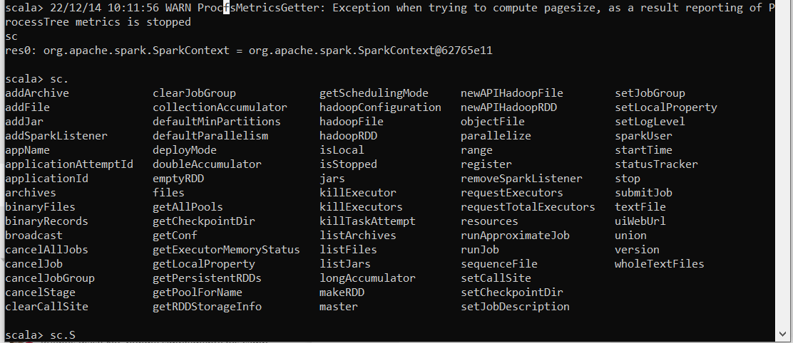
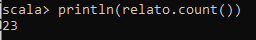
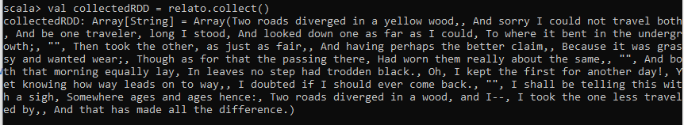
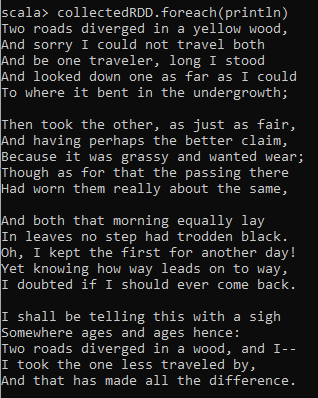
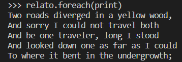
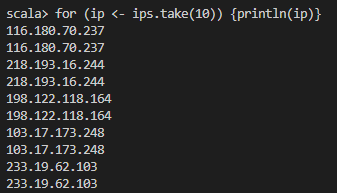
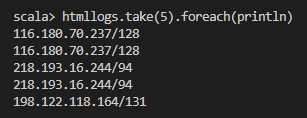
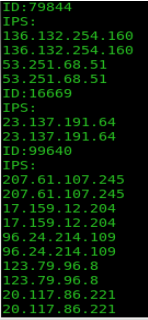

# Spark Exercises
Basado en el pdf EXERCISES SPARK BIT - EN

- [Spark Exercises](#spark-exercises)
  - [Module 1. Exercise: Using the Spark Shell](#module-1-exercise-using-the-spark-shell)
  - [Module 2. Exercise: Starting with RDDs](#module-2-exercise-starting-with-rdds)
    - [A. Exploration of plain file 1](#a-exploration-of-plain-file-1)
    - [B. Exploration of plain file 2](#b-exploration-of-plain-file-2)
    - [C. Exploration of a set of plain files a folder](#c-exploration-of-a-set-of-plain-files-a-folder)
  - [Module 4. Exercise: Working with PairRDDs](#module-4-exercise-working-with-pairrdds)
    - [A- Work with every data of the logs folder: “C:\\Users\\didac.blanco\\Desktop\\BIT\\data\\weblogs”](#a--work-with-every-data-of-the-logs-folder-cusersdidacblancodesktopbitdataweblogs)


## Module 1. Exercise: Using the Spark Shell 

The purpose of this exercise is to work with the Spark Shell in Scala to read a file in a RDD.
Tasks to be done:

1. Start the Spark Shell for Scala and get familiar with the information that appears on the 
screen (Infos, warnings, Scala’s version, Spark’s version …). It will take a little while to 
get started. 
    >spark-shell
    
    >pyspark
2. Check if a context “sc” has been successfully created as we can see in the documentation. You should see something like this in your screen:
res0:org.apache.spark.SparkContext= org.apache.spark.SparkContext@”alphanum”
    >Escribir “sc”

    >En python sale: 
    "\<SparkContext master=local[*] appName=PySparkShell>"
1. Using the auto-complete command on SparkContext you can see a list of available 
methods. The Auto-complete function consists of pressing tabulator key after typing the 
SparkContext object followed by a dot. 
    
1. To exit the Shell you can type “exit” or you can press CTRL + C.

## Module 2. Exercise: Starting with RDDs

The objective of this exercise is to practice with RDD’s trough Spark Shell, for which we will use 
external files.

A common practice testing phase of data analitics is to analyze small files that are subsets of 
related datasets to be used in production. Sometimes, these files are not physically in any 
node of the cluster, so it will be necessary to import them in some way

A simple way to do these transfers between our Host and the VM/Cluster is through tools like 
Winscp (https://winscp.net/eng/download.php).
Another option to do this is as in the previous exercises, in other words, through a shared folder
with the VM or copying the files directly to the VM.

### A. Exploration of plain file 1

Tasks to be done:

> Al trabajar desde el propio Windows, los primeros 5 pasos no los realizo tal y como dice.

1. Start the Spark Shell if you have exited in the previous exercise.

2. For this exercise we are going to work with local data
To access to a local file, we will type, before the path, the word “file:”

1. Create a folder called BIT in “/home” in a way in which it will be created a path 
“/home/BIT” and copy inside it every data file necessary to the course:
Copy ‘data_spark’ folder to the virtual machine as in other occasions y get 
familiar with their content 

1. Inside ‘data_spark’ you will find the file ‘relato.txt’. Copy that file to the virtual machine 
in the next path: “/home/BIT/data/relato.txt”

1. Visualize the file with a text editor like ‘gedit’ or ‘vi’ through the shell with ‘cat’ 
command.

1. Create a RDD called “relato”, it RDD should contain the content of the file using ‘textFile’ 
method 

    `val relato = spark.read.textFile("C:\\Users\\didac.blanco\\Desktop\\BIT\\data\\relato.txt")`

    `relato = sc.textFile("C:\\Users\\didac.blanco\\Desktop\\BIT\\data\\relato.txt")`

1. Once you have done it, notes that the RDD has not yet been created. This will happen 
when we will execute an action on the RDD.

1. Count the number of lines of the RDD y take a look to the result. If that result is 23, it’s 
correct.

    


1. Execute “collect()” method on the RDD and observe the result. Remember what we said 
during the course about when it’s recommendable to use this method.

    > Hay que tener precaución con el métedo collect() porque devuelve todos los datos en local en el driver de Spark y podría causar problemas de memoria con RDDs muy grandes

    `val collectedRDD = relato.collect()`

    

1.   Observe the rest of methods that we can apply on the RDD like we saw in the last 
exercise

        Algunos métodos interesantes aplicables a RDDs son:

        `filter`: permite filtrar los elementos de un RDD mediante una función de filtro especificada

        `map`: permite transformar cada elemento de un RDD mediante una función de transformación especificada

        `flatMap`: permite transformar cada elemento de un RDD en una secuencia de elementos, y luego concatenar todas las secuencias en un único RDD

        `reduce`: permite reducir todos los elementos de un RDD a un único valor mediante una función de reducción especificada

        `sortBy`: permite ordenar los elementos de un RDD mediante una función de clave especificada

        `distinct`: permite eliminar duplicados en un RDD

        `union`: permite combinar dos RDDs en un único RDD

        `intersection`: permite obtener la intersección de dos RDDs (es decir, los elementos que están presentes en ambos RDDs)
    

1.   If you have time, research about how to use “foreach” function to visualize the content 
of the RDD in a more appropriate way to understand it

        

        En python nos encontramos que `.collect()` ha creado una lista en vez de otro RDD, lo cual hace que no podamos escribir la misma sentencia en python. 

        

### B. Exploration of plain file 2

Tasks to be done
1. Copy the weblogs folder contained in the Spark’s exercises folder to 
“/home/BIT/data/weblogs/” and checks its content
2. Choose one of the files, open it and study how it’s structured every one of their lines 
(the data that contains, separators (white space), etc…)

3. 116.180.70.237 is the IP, 128 is the user number y GET /KBDOC-00031.html HTTP/1.0
is the article where the action rests.
4. Create a variable that contains the path of the file, for example: file:/home/BIT/data/weblogs/2013-09-15.log

    `val logPath = "file:///C:/Users/didac.blanco/Desktop/BIT/data/weblogs/2013-09-15.log"`

    En python `log_path = "file:///C:/Users/didac.blanco/Desktop/BIT/data/weblogs/2013-09-15.log"`

1. Create an RDD with the content of the file called ‘logs’

    `val logs = sc.textFile(logPath)`

    `logs = sc.textFile(log_path)`

2. Create a new RDD, ‘jpglogs’, containing only the RDD lines that contain the character 
string “.jpg”. You can use the ‘contains()’ method.

    `val jpglogs = logs.filter(x => x.contains(".jpg"))`

    `jpglogs = logs.filter(lambda x: ".jpg" in x)`

1. Print in the screen the 5 first lines of ‘jpglogs’
   
    `jpglogs.take(5).foreach(println)`

    ```python
    for log in jpglogs.take(5):
        print(log)
    ```

2. It is possible to nest several methods in the same line. Create a variable ‘jpglogs2’ that 
returns the number of lines containing the character string “.jpg”.

    `val jpglogs2 = jpglogs.count`
    
    `jpglogs2 = jpglogs.count()`

1. We will now start using one of the most important functions in Spark: “map()”. To do 
this, take the ‘logs’ RDD and calculate the length of the first 5 lines. You can use the 
functions: “size()” or “length()”. Remember that the “map()” function execute one 
function on each line of the RDD, not on the total set of the RDD.

    `logs.take(5).map(line => line.length()).foreach(println)`

    > La diferencia de python en este caso es que logs.take(5) devuelve una lista, en la cual no se puede aplicar el método map() de pySpark, la única opción es aplicar la función map() de la siguiente manera, aplicando posteriormente la función list para que nos devuelva el resultado. Tener en cuenta que esta forma es para utilizar map(), hay otras maneras de conseguir el resultado sin usar map().

    `list(map(lambda x: print(len(x)), logs.take(5)))`


1.  Print in the screen every word that contains each of the first 5 lines of the ‘logs’ RDD. 
You can use the function: “split()”.

    `logs.take(5).foreach(line => line.split(" ").foreach(println))`

    `[line.split(" ") for line in logs.take(5)]`

1.  Map the contents of the logs to an RDD called “logwords” whose contents are arrays of 
words for each line.

    `val logwords = logs.map(line => line.split(" "))`

    `logwords = logs.map(lambda x: x.split(" "))`

1.  Create a new RDD called “ips” from RDD “logs” that only contains the IPs of each line

    `val ips = logs.map(line => line.split(" ")(0))`

    `ips = logs.map(lambda line: line.split(" ")[0])`


2.  Print in the screen the first 5 lines of “ips”

    `ips.take(5).foreach(println)`

    `[print(line) for line in ips.take(5)]`

3.  Take a look to the content of “ips” with “collect()” function. You will find it’s not intuitive 
enough. Try using the “foreach” command.

    `ips.collect()`

    ```py
    for ip in ips.collect():
        print(ip)
    ```


1.  Create a “for” loop to display the contents of the first 10 lines of “ips”. Help: A ‘for’ loop 
has the following structure:
scala> for (x <- rdd.take()) { print(x) }

    `for (ip <- ips.take(10)) {println(ip)}`

    

    ```py
    for ip in ips.take(10):
        print(ip)
    ```

1.  Save the whole content of “ips” in a text file using the method “saveAsTextFile” (in the 
path: “/home/cloudera/iplist”) and take a look at its contents:

    `ips.saveAsTextFile("C:\\Users\\didac.blanco\\Desktop\\BIT\\iplist")`
    `ips.saveAsTextFile("C:\\Users\\didac.blanco\\Desktop\\BIT\\iplist_python")`

### C. Exploration of a set of plain files a folder

Tasks to do:
1. Create an RDD that only contains the IPs of every document of the path: 
“C:\\Users\\didac.blanco\\Desktop\\BIT\\data\\weblogs”. Save its contents in the path: “C:\\Users\\didac.blanco\\Desktop\\BIT\\iplistw” 
and observe its content

    ```
    val logs = sc.textFile("C:\\Users\\didac.blanco\\Desktop\\BIT\\data\\weblogs")
    val ips = logs.map(_.split(" ")(0))
    ips.saveAsTextFile("C:\\Users\\didac.blanco\\Desktop\\BIT\\iplistw")
    ```

    ```py
    logs = sc.textFile("C:\\Users\\didac.blanco\\Desktop\\BIT\\data\\weblogs")
    ips = logs.map(lambda x: x.split(" ")[0])
    ips.saveAsTextFile("C:\\Users\\didac.blanco\\Desktop\\BIT\\iplistw_python")
    ```

    o, en una única línea (en scala):

    `sc.textFile("C:\\Users\\didac.blanco\\Desktop\\BIT\\data\\weblogs").map(_.split(" ")(0)).saveAsTextFile("C:\\Users\\didac.blanco\\Desktop\\BIT\\iplistw2")`

2. From the “logs” RDD, create an RDD called “htmllogs” containing only: IP and user ID of 
each “html” file. The user ID is the third field of each log line. Then print the first 5 lines. 
An example would be:

    `val htmllogs = logs.map(x => x.split(" ")(0)+"/"+x.split(" ")(2))`

    

    `htmllogs = logs.map(lambda x: x.split(" ")[0]+"/"+x.split(" ")[2])`


## Module 4. Exercise: Working with PairRDDs

The objective of this exercise is to get familiar with the work with pair RDD.
### A- Work with every data of the logs folder: “C:\\Users\\didac.blanco\\Desktop\\BIT\\data\\weblogs” 
Tasks to do:
1. Using MapReduce count the number of requests of each user, in other words, count the 
number of times that each user appears on a line of a log. For that:

    a. Use a Map to create a RDD that contains the pair (ID,1), where the key is the ID 
field and the Value is the number 1. Remember that ID field is the third element 
of each line. The data obtained should look like this:

    ```
    (userida, 1)
    (userida, 1)
    (useridb, 1)
    ```

    b. Use a Reduce to sum the values of each “userid”. The data obtained should look 
like this:

    ```
    (userida, 4)
    (useridb, 8)
    (useridc, 12)
    ```

    ```scala
    val idRDD = logs.map(line => (line.split(" ")(2), 1))
    val sumRDD = idRDD.reduceByKey((x,y)=>x+y)
    ```

    ```py
    idRDD = logs.map(lambda line: (line.split(" ")[2], 1))
    sumRDD = idRDD.reduceByKey(lambda x, y: x+y)
    ```


2. Show the users id and the number of accesses for the 10 users with the highest access 
number. For that:
a. Use a “map()” to swap the Key for the Value, so you will get something like this 
(If you do not know how to do that, search on the internet):

    (4, userida)

    (8, useridb)

    (12, useridc)

    ```scala
    val sumRDD2 = sumRDD.map { case (char, num) => (num, char) }
    ```

    ```py
    sumRDD2 = sumRDD.map(lambda x: (x[1], x[0]))
    ```


    b. Use the function we saw in theory to order a RDD. Please note that we want to 
    show the data in descending order (From highest to lowest number of requests). 
    Remember that the RDD obtained must have the same structure as the original 
    RDD, in other words, with Key: “userid” and Value: “number of requests”. The 
    result should be:

    ```scala
    val rddSorted = sumRDD2.sortBy(-_._1)
    val resRddSorted = rddSorted.map { case (num, char) => (char, num) }
    ```

    ```py
    rddSorted = sumRDD2.sortBy(lambda x: -x[0])
    resRddSorted = rddSorted.map(lambda x: (x[1], x[0]))
    ```

1. Create a RDD with Key: “userid” and Value: a list of IP to which the previous “userid” has 
been connected (In other words, group the IPs for “userID”). Use “groupByKey()” function 
to do that, so the final result should be something like this: 

    (userid,[20.1.34.55, 74.125.239.98])

    (userid,[75.175.32.10,245.33.1.1,66.79.233.99])

    (userid,[65.50.196.141])


    If you have enough time try to show the RDD obtained on the screen, so that its structure 
    looks like this:
    
    
 
    ```scala
    val ipIdRDD = logs.map(line => (line.split(" ")(2), line.split(" ")(0)))
    val groupedRDD = ipIdRDD.groupByKey()
    groupedRDD.foreach { case (id, ips) =>
    println(s"ID: $id")
    println("IPS:")
    ips.foreach(println)
    }
    ```

    ```py
    ip_id_rdd = logs.map(lambda x: (x.split(" ")[2], x.split(" ")[0]))
    grouped_rdd = ip_id_rdd.groupByKey()
    for id, ips in grouped_rdd.collect():
        print(f"ID: {id}")
        print("IPS:")
        for ip in ips:
            print(ip)
    ```
