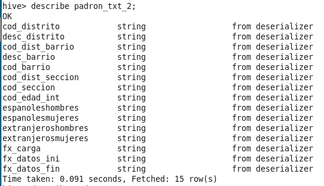
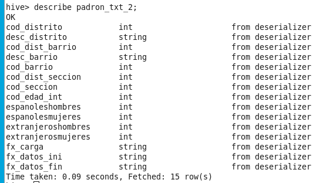
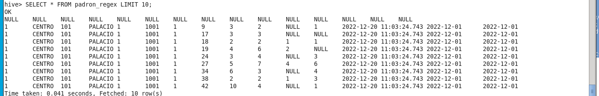

# Práctica Hive + Impala + HDFS + Spark
A partir de los datos (CSV) de Padrón de Madrid (https://datos.madrid.es/egob/catalogo/200076-1-padron.csv) llevar a cabo lo siguiente:
## 1 - Creación de tablas en formato texto.
1. Crear Base de datos "datos_padron"

    ```
    CREATE DATABASE padron;
    ```
    
2. Crear la tabla de datos padron_txt con todos los campos del fichero CSV y cargar los datos mediante el comando LOAD DATA LOCAL INPATH. La tabla tendrá formato texto y tendrá como delimitador de campo el caracter ';' y los campos que en el documento original están encerrados en comillas dobles '"' no deben estar envueltos en estos caracteres en la tabla de Hive (es importante indicar esto utilizando el serde de OpenCSV, si no la importación de las variables que hemos indicado como numéricas fracasará ya que al estar envueltos en comillas los toma como strings) y se deberá omitir la cabecera del fichero de datos al crear la tabla.

    ```sql
    set hive.serdes.using.metastore.for.schema=org.apache.hadoop.hive.serde2.OpenCSVSerde; --permite la lectura correcta con el formato de cada columna, sin este comando se convierte todo en string

    CREATE TABLE padron_txt(
        COD_DISTRITO      INT,
        DESC_DISTRITO     STRING,
        COD_DIST_BARRIO   INT,
        DESC_BARRIO       STRING,
        COD_BARRIO        INT,
        COD_DIST_SECCION  INT,
        COD_SECCION       INT,
        COD_EDAD_INT      INT,
        ESPANOLESHOMBRES  INT,
        ESPANOLESMUJERES  INT,
        EXTRANJEROSHOMBRES INT,
        EXTRANJEROSMUJERES INT,
        FX_CARGA          STRING,
        FX_DATOS_INI      STRING,
        FX_DATOS_FIN      STRING
    )
    ROW FORMAT SERDE 'org.apache.hadoop.hive.serde2.OpenCSVSerde'
    WITH SERDEPROPERTIES (
    "separatorChar" = "\073",
    "quoteChar"     = "\"",
    "skip.header.line.count" = "1"
    )
    STORED AS TEXTFILE;

    LOAD DATA LOCAL INPATH '/home/cloudera/ejercicios/padron/estadisticas202212.csv'
    INTO TABLE padron_txt;
    ```

    ```SQL
    DESCRIBE padron_txt;
    SELECT * FROM padron_txt LIMIT 5;
    ```

3. Hacer trim sobre los datos para eliminar los espacios innecesarios guardando la tabla resultado como padron_txt_2. (Este apartado se puede hacer creando la tabla con una sentencia CTAS.)

    ```sql
    CREATE TABLE padron_txt_2 AS
    SELECT
    COD_DISTRITO AS COD_DISTRITO,
    TRIM(DESC_DISTRITO) AS DESC_DISTRITO,
    COD_DIST_BARRIO AS COD_DIST_BARRIO,
    TRIM(DESC_BARRIO) AS DESC_BARRIO,
    COD_BARRIO AS COD_BARRIO,
    COD_DIST_SECCION AS COD_DIST_SECCION,
    COD_SECCION AS COD_SECCION,
    COD_EDAD_INT AS COD_EDAD_INT,
    ESPANOLESHOMBRES AS ESPANOLESHOMBRES,
    ESPANOLESMUJERES AS ESPANOLESMUJERES,
    EXTRANJEROSHOMBRES AS EXTRANJEROSHOMBRES,
    EXTRANJEROSMUJERES AS EXTRANJEROSMUJERES,
    TRIM(FX_CARGA) AS FX_CARGA,
    TRIM(FX_DATOS_INI) AS FX_DATOS_INI,
    TRIM(FX_DATOS_FIN) AS FX_DATOS_FIN
    FROM padron_txt;
    ```
    ```SQL
    DESCRIBE padron_txt_2;
    ```
    

    ```sql
    ALTER TABLE padron_txt_2 CHANGE COD_DISTRITO COD_DISTRITO INT;
    ALTER TABLE padron_txt_2 CHANGE COD_DIST_BARRIO COD_DIST_BARRIO INT;
    ALTER TABLE padron_txt_2 CHANGE COD_BARRIO COD_BARRIO INT;
    ALTER TABLE padron_txt_2 CHANGE COD_DIST_SECCION COD_DIST_SECCION INT;
    ALTER TABLE padron_txt_2 CHANGE COD_SECCION COD_SECCION INT;
    ALTER TABLE padron_txt_2 CHANGE COD_EDAD_INT COD_EDAD_INT INT;
    ALTER TABLE padron_txt_2 CHANGE ESPANOLESHOMBRES ESPANOLESHOMBRES INT;
    ALTER TABLE padron_txt_2 CHANGE ESPANOLESMUJERES ESPANOLESMUJERES INT;
    ALTER TABLE padron_txt_2 CHANGE EXTRANJEROSHOMBRES EXTRANJEROSHOMBRES INT;
    ALTER TABLE padron_txt_2 CHANGE EXTRANJEROSMUJERES EXTRANJEROSMUJERES INT;
    ```
    ```SQL
    DESCRIBE padron_txt_2;
    ```
    
4. Investigar y entender la diferencia de incluir la palabra LOCAL en el comando LOAD DATA.

    >Si utilizamos la opción 'local' en 'load data', estamos especificando la lectura en el sistema de archivos utilizado en la máquina donde se ejecuta Hive. Si no incluyes 'local', Hive asume que los datos se encuentran en HDFS y tratará de cargarlos desde allí.

5. En este momento te habrás dado cuenta de un aspecto importante, los datos nulos de nuestras tablas vienen representados por un espacio vacío y no por un identificador de nulos comprensible para la tabla. Esto puede ser un problema para el tratamiento posterior de los datos. Podrías solucionar esto creando una nueva tabla utilizando sentencias case when que sustituyan espacios en blanco por 0. Para esto primero comprobaremos que solo hay espacios en blanco en las variables numéricas correspondientes a las últimas 4 variables de nuestra tabla (podemos hacerlo con alguna sentencia de HiveQL) y luego aplicaremos las sentencias case when para sustituir por 0 los espacios en blanco. (Pista: es útil darse cuenta de que un espacio vacío es un campo con longitud 0). Haz esto solo para la tabla padron_txt.

    > No he podido editar la tabla existente así que he creado padron_txt_3

    ```sql
    CREATE TABLE padron_txt_3 AS
    SELECT
    COD_DISTRITO,
    DESC_DISTRITO,
    COD_DIST_BARRIO,
    DESC_BARRIO,
    COD_BARRIO,
    COD_DIST_SECCION,
    COD_SECCION,
    COD_EDAD_INT,
    CASE WHEN ESPANOLESHOMBRES = '' THEN 0 ELSE ESPANOLESHOMBRES END AS ESPANOLESHOMBRES,
    CASE WHEN ESPANOLESMUJERES = '' THEN 0 ELSE ESPANOLESMUJERES END AS ESPANOLESMUJERES,
    CASE WHEN EXTRANJEROSHOMBRES = '' THEN 0 ELSE EXTRANJEROSHOMBRES END AS EXTRANJEROSHOMBRES,
    CASE WHEN EXTRANJEROSMUJERES = '' THEN 0 ELSE EXTRANJEROSMUJERES END AS EXTRANJEROSMUJERES
    FROM padron_txt;
    ```

    ```
    ALTER TABLE padron_txt_3 CHANGE COD_DISTRITO COD_DISTRITO INT;
    ALTER TABLE padron_txt_3 CHANGE COD_DIST_BARRIO COD_DIST_BARRIO INT;
    ALTER TABLE padron_txt_3 CHANGE COD_BARRIO COD_BARRIO INT;
    ALTER TABLE padron_txt_3 CHANGE COD_DIST_SECCION COD_DIST_SECCION INT;
    ALTER TABLE padron_txt_3 CHANGE COD_SECCION COD_SECCION INT;
    ALTER TABLE padron_txt_3 CHANGE COD_EDAD_INT COD_EDAD_INT INT;
    ALTER TABLE padron_txt_3 CHANGE ESPANOLESHOMBRES ESPANOLESHOMBRES INT;
    ALTER TABLE padron_txt_3 CHANGE ESPANOLESMUJERES ESPANOLESMUJERES INT;
    ALTER TABLE padron_txt_3 CHANGE EXTRANJEROSHOMBRES EXTRANJEROSHOMBRES INT;
    ALTER TABLE padron_txt_3 CHANGE EXTRANJEROSMUJERES EXTRANJEROSMUJERES INT;
    ```

6. Una manera tremendamente potente de solucionar todos los problemas previos (tanto las comillas como los campos vacíos que no son catalogados como null y los espacios innecesarios) es utilizar expresiones regulares (regex) que nos proporciona OpenCSV. Para ello utilizamos: ROW FORMAT SERDE 'org.apache.hadoop.hive.serde2.RegexSerDe' WITH SERDEPROPERTIES ('input.regex'='XXXXXXX') Donde XXXXXX representa una expresión regular que debes completar y que identifique el formato exacto con el que debemos interpretar cada una de las filas de nuestro CSV de entrada. Para ello puede ser útil el portal "regex101". Utiliza este método para crear de nuevo la tabla padron_txt_2.

    ```sql
    CREATE TABLE padron_regex(
    COD_DISTRITO      INT,
    DESC_DISTRITO     STRING,
    COD_DIST_BARRIO   INT,
    DESC_BARRIO       STRING,
    COD_BARRIO        INT,
    COD_DIST_SECCION  INT,
    COD_SECCION       INT,
    COD_EDAD_INT      INT,
    ESPANOLESHOMBRES  INT,
    ESPANOLESMUJERES  INT,
    EXTRANJEROSHOMBRES INT,
    EXTRANJEROSMUJERES INT,
    FX_CARGA          STRING,
    FX_DATOS_INI      STRING,
    FX_DATOS_FIN      STRING
    )
    ROW FORMAT SERDE 'org.apache.hadoop.hive.serde2.RegexSerDe'
    WITH SERDEPROPERTIES('input.regex'='^(\\d+)\\\;\\\"([A-Za-z]+)\\s*\\\"\\\;(\\d+)\\\;\\\"([A-Za-z]+)\\s*\\\"\\\;(\\d+)\\\;(\\d+)\\\;(\\d+)\\\;\\\"(\\d+)\\\"\\\;(\\d*)\\\;(\\d*)\\\;(\\d*)\\\;(\\d*)\\\;\\\"(\\d*-\\d*-\\d*\\s\\d*:\\d*:\\d*\\d*\\.\\d*)\\"\\;\\"(\\d*-\\d*-\\d*)\\\"\\\;\\\"(\\d*-\\d*-\\d*)\\\"$', "skip.header.line.count" = "1");

    LOAD DATA LOCAL INPATH '/home/cloudera/ejercicios/padron/estadisticas202212.csv'
    INTO TABLE padron_regex;
    ```

    

Una vez finalizados todos estos apartados deberíamos tener una tabla padron_txt que conserve los espacios innecesarios, no tenga comillas envolviendo los campos y los campos nulos sean tratados como valor 0 y otra tabla padron_txt_2 sin espacios innecesarios, sin comillas envolviendo los campos y con los campos nulos como valor 0. Idealmente esta tabla ha sido creada con las regex de OpenCSV.

## 2 - Investigamos el formato columnar parquet.

1. ¿Qué es CTAS?

    >CTAS (CREATE TABLE AS SELECT): es una consulta SQL que permite crear una nueva tabla en una base de datos a partir de los datos de otra tabla existente.
2. Crear tabla Hive padron_parquet (cuyos datos serán almacenados en el formato columnar parquet) a través de la tabla padron_txt mediante un CTAS.

    ```sql
    CREATE TABLE padron_parquet
    STORED AS PARQUET
    AS SELECT * FROM padron_txt;
    ```
3. Crear tabla Hive padron_parquet_2 a través de la tabla padron_txt_2 mediante un CTAS. En este punto deberíamos tener 4 tablas, 2 en txt (padron_txt y padron_txt_2, la primera con espacios innecesarios y la segunda sin espacios innecesarios) y otras dos tablas en formato parquet (padron_parquet y padron_parquet_2, la primera con espacios y la segunda sin ellos).

    ```sql
    CREATE TABLE padron_parquet_2
    STORED AS PARQUET
    AS SELECT * FROM padron_txt_2;
    ```
4. Opcionalmente también se pueden crear las tablas directamente desde 0 (en lugar de mediante CTAS) en formato parquet igual que lo hicimos para el formato txt incluyendo la sentencia STORED AS PARQUET. Es importante para comparaciones posteriores que la tabla padron_parquet conserve los espacios innecesarios y la tabla padron_parquet_2 no los tenga. Dejo a tu elección cómo hacerlo.
5. Investigar en qué consiste el formato columnar parquet y las ventajas de trabajar con este tipo de formatos.

    >ventajas del formato columnar:
   1. eficiencia de almacenamiento: normalmente las columnas tienen el mismo formato y valores parecidos entre ellos
   2. mayor velocidad de lectura: en las querys estilo SQL, al trabajar con columnas para filtrar, ordenar, o simplemente leer datos, el formato columnar permite no tener que leer datos innecesarios como hariamos al guardar por filas
   3. mayor escalabilidad: formato escalable y compatible con entornos distribuidos
6. Comparar el tamaño de los ficheros de los datos de las tablas padron_txt (txt), padron_txt_2 (txt pero no incluye los espacios innecesarios), padron_parquet y padron_parquet_2 (alojados en hdfs cuya ruta se puede obtener de la propiedad location de cada tabla por ejemplo haciendo "show create table").
    >los dos archivos correspondientes a la tabla parquet ocupan lo mismo: 1.2MB, mientras que la tabla sin procesar padron_txt ocupa 30MB, y la tabla procesada padron_txt_clean ocupa 12MB

## 3 - Juguemos con Impala

1. ¿Qué es Impala?
   >Impala es una herramienta para ejecutar consultas SQL en grandes conjuntos de datos en sistemas Hadoop de manera rápida y escalable.
2. ¿En qué se diferencia de Hive?
   1. Hive se enfoca en consultas a gran escala con HiveQL, mientras que Impala se enfoca en consultas en tiempo real con SQL estándar.
   2. Hive tiene una arquitectura basada en mapreduce, mientras que Impala tiene una arquitectura basada en máquinas.
   3. Impala suele ser más rápido que Hive para consultas en tiempo real, pero Hive puede ser más adecuado para consultas a gran escala con procesamiento de mapreduce.
3. Comando INVALIDATE METADATA, ¿en qué consiste?
   > El comando INVALIDATE METADATA es un comando de Impala que se utiliza para informar al sistema de que los metadatos de una tabla o vista han cambiado y deben volver a leerse. Se puede especificar un nombre de tabla o vista para invalidar solo sus metadatos o no especificar ningún nombre para invalidar los metadatos de todas las tablas y vistas en la base de datos actual. Este comando no afecta a los datos de la tabla o vista, solo a sus metadatos, y no debe utilizarse con frecuencia para evitar impactar el rendimiento del sistema.
4. Hacer invalidate metadata en Impala de la base de datos datos_padron.
    ```sql
    impala-shell
    show databases;
    use datos_padron;
    invalidate metadata;
    ```

    
5. Calcular el total de EspanolesHombres, espanolesMujeres,ExtranjerosHombres y ExtranjerosMujeres agrupado por DESC_DISTRITO y DESC_BARRIO.

    ```sql
    SELECT desc_distrito, desc_barrio, sum(cast(EspanolesHombres AS int)) AS EspanolesHombres, sum(cast(espanolesMujeres AS int)) AS espanolesMujeres, sum(cast(ExtranjerosHombres AS int)) AS ExtranjerosHombres, sum(cast(ExtranjerosMujeres AS int)) AS ExtranjerosMujeres
    FROM padron_txt_clean
    GROUP BY desc_distrito, desc_barrio;
    ```

    ```sql
    SELECT desc_distrito, desc_barrio, sum(cast(EspanolesHombres AS int)) AS EspanolesHombres, sum(cast(espanolesMujeres AS int)) AS espanolesMujeres, sum(cast(ExtranjerosHombres AS int)) AS ExtranjerosHombres, sum(cast(ExtranjerosMujeres AS int)) AS ExtranjerosMujeres
    FROM padron_parquet_clean
    GROUP BY desc_distrito, desc_barrio;
    ```
6. Llevar a cabo las consultas en Hive en las tablas padron_txt_2 y padron_parquet_2 (No deberían incluir espacios innecesarios). ¿Alguna conclusión?

    >sobre la tabla en formato normal, hive tardó 38.2s, y con el formato parquet tardó 32.5s
7. Llevar a cabo la misma consulta sobre las mismas tablas en Impala. ¿Alguna conclusión?

    >sobre la tabla en formato normal, impala tardó 0.94s, y con el formato parquet tardó 0.71s
8. ¿Se percibe alguna diferencia de rendimiento entre Hive e Impala?

    >la diferencia en tiempos de ejecución es clara

## 4 - Sobre tablas particionadas

1. Crear tabla (Hive) padron_particionado particionada por campos DESC_DISTRITO y DESC_BARRIO cuyos datos estén en formato parquet.

```sql
CREATE TABLE padron_particionado (
  COD_DISTRITO INT,
  COD_DIST_BARRIO INT,
  COD_BARRIO INT,
  COD_DIST_SECCION INT,
  COD_SECCION INT,
  COD_EDAD_INT INT,
  ESPANOLESHOMBRES INT,
  ESPANOLESMUJERES INT,
  EXTRANJEROSHOMBRES INT,
  EXTRANJEROSMUJERES INT,
  FX_CARGA STRING,
  FX_DATOS_INI STRING,
  FX_DATOS_FIN STRING
)
PARTITIONED BY (DESC_DISTRITO STRING, DESC_BARRIO STRING)
ROW FORMAT SERDE 'org.apache.hadoop.hive.serde2.OpenCSVSerde'
WITH SERDEPROPERTIES (
   "separatorChar" = "\073",
   "quoteChar"     = "\"",
   "skip.header.line.count" = "1"
)
STORED AS PARQUET;
```

2. Insertar datos (en cada partición) dinámicamente (con Hive) en la tabla recién creada a partir de un select de la tabla padron_parquet_2.

    ```sql
    SET hive.exec.dynamic.partition=true;
    SET hive.exec.dynamic.partition.mode=non-strict;
    SET hive.enforce.bucketing =true;​

    INSERT OVERWRITE TABLE padron_particionado PARTITION(DESC_DISTRITO, DESC_BARRIO)
    SELECT COD_DISTRITO, COD_DIST_BARRIO, COD_BARRIO, COD_DIST_SECCION, COD_SECCION, COD_EDAD_INT, ESPANOLESHOMBRES, ESPANOLESMUJERES, EXTRANJEROSHOMBRES, EXTRANJEROSMUJERES, FX_CARGA, FX_DATOS_INI, FX_DATOS_FIN, DESC_DISTRITO, DESC_BARRIO from  padron_parquet;
    ```

3. Hacer invalidate metadata en Impala de la base de datos padron_particionado.

4. Calcular el total de EspanolesHombres, EspanolesMujeres, ExtranjerosHombres y ExtranjerosMujeres agrupado por DESC_DISTRITO y DESC_BARRIO para los distritos CENTRO, LATINA, CHAMARTIN, TETUAN, VICALVARO y BARAJAS.

5. Llevar a cabo la consulta en Hive en las tablas padron_parquet y padron_partitionado. ¿Alguna conclusión?

6. Llevar a cabo la consulta en Impala en las tablas padron_parquet y padron_particionado. ¿Alguna conclusión?

7. Hacer consultas de agregación (Max, Min, Avg, Count) tal cual el ejemplo anterior con las 3 tablas (padron_txt_2, padron_parquet_2 y padron_particionado) y comparar rendimientos tanto en Hive como en Impala y sacar conclusiones.